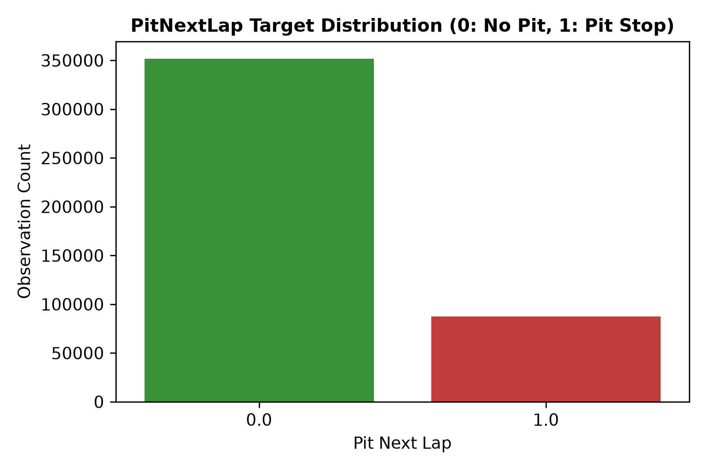
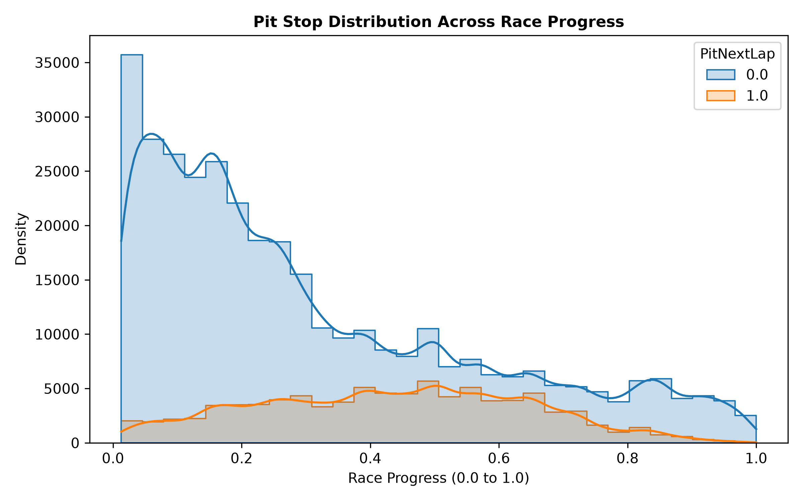
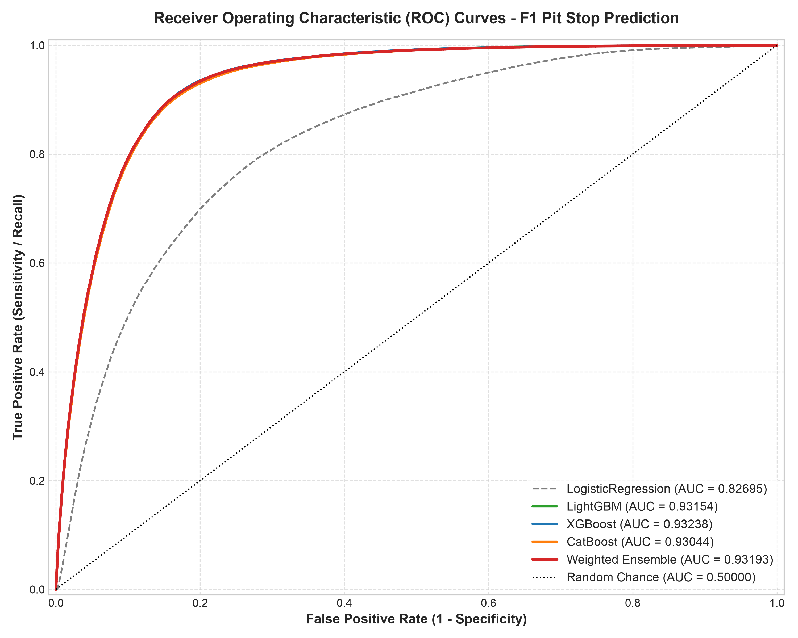
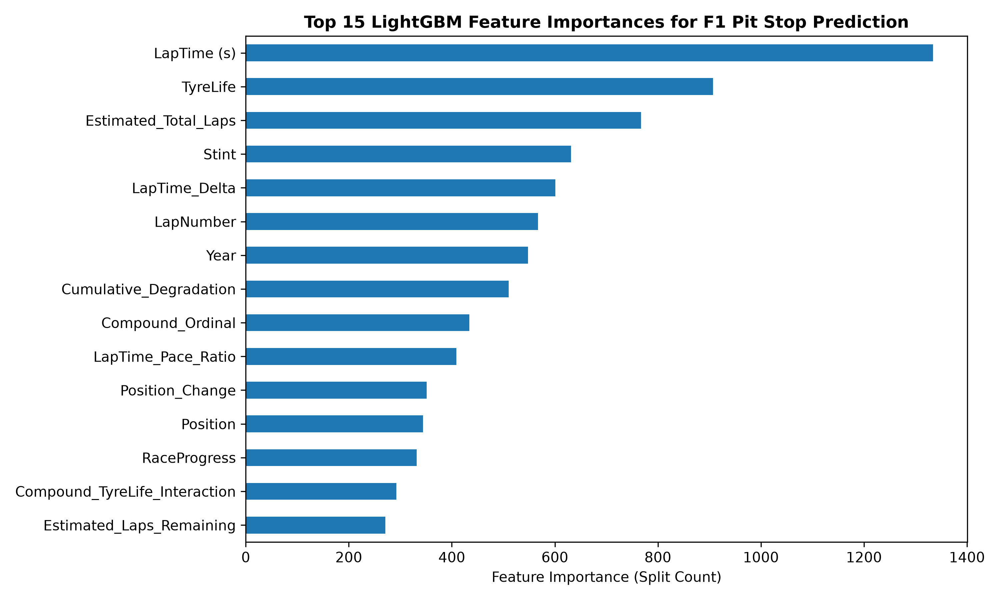
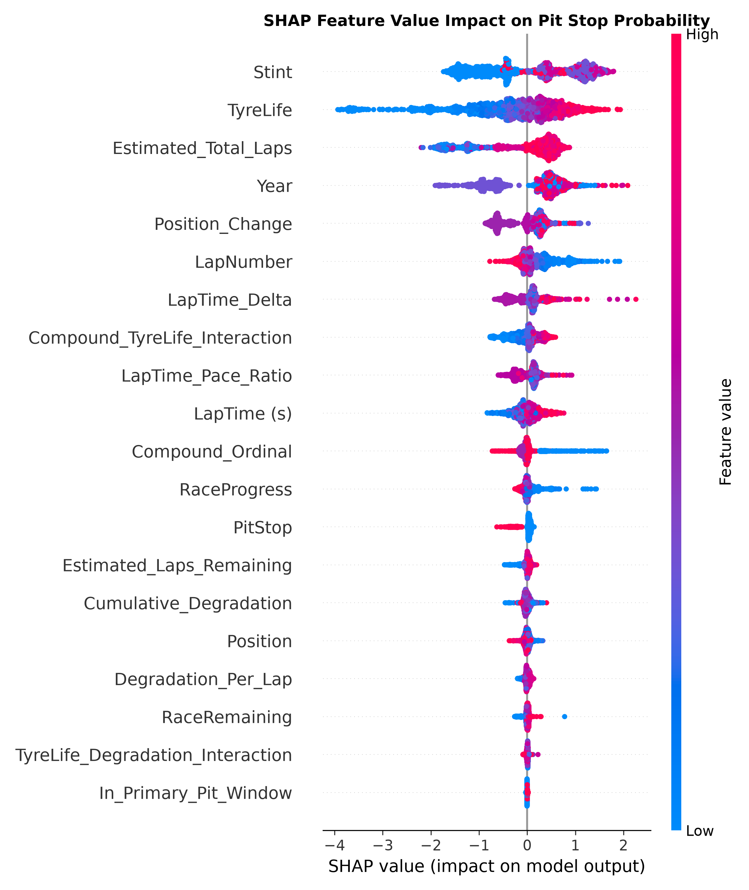

## 1. Executive Summary

This report documents the machine learning pipeline developed to predict Formula 1 pit stops on the next lap (`PitNextLap`) using the Kaggle **Playground Series S6E5** dataset.

Predicting when an F1 car will enter the pit lane is critical for race telemetry strategy, undercut/overcut detection, and live race simulation. Using data across 104 Grand Prix events from 2022 to 2025 (439,140 training observations and 188,165 test observations), we built a leak-free 5-fold `StratifiedGroupKFold` cross-validation system grouped by Grand Prix event ID (`EventID`).

The strongest cross-validated model was **XGBoost**, which achieved:

- **ROC-AUC**: **0.93238**
- **LogLoss**: **0.25753**
- **PR-AUC**: **0.73909**

We also generated the final test predictions with a weighted ensemble of
LightGBM, XGBoost, CatBoost, and Logistic Regression. The ensemble was
competitive, but did not outperform XGBoost in the reported out-of-fold
evaluation.

---

## 2. Dataset Overview & Data Audit

The dataset consists of detailed lap-by-lap race telemetry metrics for drivers across Formula 1 seasons:

- **Train Samples**: 439,140 rows x 16 columns
- **Test Samples**: 188,165 rows x 15 columns
- **Target Variable**: `PitNextLap` (1 = Driver pits on next lap, 0 = Driver stays out)
- **Class Imbalance**: ~19.90% positive class (`PitNextLap = 1`), ~80.10% negative class (`PitNextLap = 0`).
- **Data Integrity**: **0 missing values** across both train and test sets.

---

## 3. Validation Strategy & Leakage Prevention

To prevent intra-race telemetry data leakage between training and validation sets, we enforced **StratifiedGroupKFold** cross-validation, grouping all rows by unique Grand Prix events (`Year` + `Race`):

$$ \text{EventID} = \operatorname{concat}(\text{Year}, \text{"\_"}, \text{Race}) $$

This ensures that entire Grand Prix weekends are kept strictly intact within either the training set or the validation set for each fold.

---

## 4. Feature Engineering

Domain-specific feature engineering was performed across three key dimensions:

1. **Stint & Tire Dynamics**:
   - `TyreLife` (current age of tire set in laps)
   - `TyreLife_Squared` ($ \text{TyreLife}^2 $)
   - `Degradation_Per_Lap` = $ \frac{\text{Cumulative\_Degradation}}{\text{TyreLife} + \epsilon} $
   - `Compound_TyreLife_Interaction` = $ \text{Compound\_Ordinal} \times \text{TyreLife} $

2. **Race Progress & Pit Window Context**:
   - `RaceRemaining` = $ 1.0 - \text{RaceProgress} $
   - `Estimated_Total_Laps` = $ \frac{\text{LapNumber}}{\text{RaceProgress} + \epsilon} $
   - `In_Primary_Pit_Window` (Indicator for $ 0.25 \le \text{RaceProgress} \le 0.85 $)

3. **Lap Pace & Position Dynamics**:
   - `LapTime_Pace_Ratio` = $ \frac{\text{LapTime\_Delta}}{\text{LapTime (s)} + \epsilon} $
   - `Is_Podium_Position` ($ \text{Position} \le 3 $)
   - `Is_Points_Position` ($ \text{Position} \le 10 $)

---

## 5. Model Evaluation & Benchmark Comparison

We evaluated four distinct algorithms across identical 5-fold StratifiedGroupKFold splits:

| Model | ROC-AUC | LogLoss | PR-AUC |
| :--- | :--- | :--- | :--- |
| **Logistic Regression (Baseline)** | 0.82695 | 0.38864 | 0.50320 |
| **CatBoost Classifier** | 0.93044 | 0.26095 | 0.73403 |
| **LightGBM Classifier** | 0.93154 | 0.25897 | 0.73527 |
| **XGBoost Classifier** | **0.93238** | **0.25753** | **0.73909** |
| **Weighted Multi-GBDT Ensemble** | **0.93193** | **0.25909** | **0.73857** |

---

## 6. Model Interpretation (SHAP Analysis)

Tree-based SHAP (SHapley Additive exPlanations) values were calculated for a
LightGBM model to inspect how its inputs affect pit-stop predictions. In the
summary plot, each point represents one sampled lap:

- Features are ordered by their mean absolute SHAP value.
- Points to the right increase the model output for `PitNextLap`; points to the
  left decrease it.
- Red points are high feature values and blue points are low feature values.
- With the default tree explainer configuration, the horizontal axis is the
  model's raw output (approximately log-odds), not a direct percentage-point
  change in probability.

The principal patterns visible in this plot are:

1. **Stint is the strongest global driver.** Later stint numbers generally push
   the model toward predicting a pit stop, while early stints tend to push it
   away.
2. **TyreLife has the clearest directional relationship.** High tire age
   strongly increases the model output, whereas fresh tires decrease it.
3. **Race length and timing provide substantial context.**
   `Estimated_Total_Laps`, `LapNumber`, and `RaceProgress` are influential, but
   they encode overlapping information and should be interpreted together.
4. **Slower-than-reference laps can raise the prediction.** High
   `LapTime_Delta` values generally push the model toward a pit stop.
5. **A current-lap pit stop usually lowers the next-lap prediction.** When
   `PitStop = 1`, the model generally considers another stop on the immediately
   following lap unlikely.
6. **Year captures season-specific structure.** Its relatively high importance
   may reflect changes in the dataset or racing patterns between seasons; it
   should not be interpreted as a causal effect.

The saved plot does **not** show degradation variables as the leading global
drivers. `Cumulative_Degradation`, `Degradation_Per_Lap`, and the
tire-life/degradation interaction rank below `Stint`, `TyreLife`, and several
race-context variables.

### Interpretation limitations

These SHAP values explain a LightGBM model trained on the full training dataset
and evaluated on a reproducible 2,000-row training sample. They do not directly
explain the weighted ensemble or the best-performing XGBoost model. Because
many engineered variables are correlated—for example `LapNumber`,
`RaceProgress`, `RaceRemaining`, and estimated laps—SHAP credit can be divided
or shifted among related features. The results describe model behavior and
associations in this dataset; they do not establish causal F1 strategy effects.

---

### Causal Analysis Considerations

Although logistic regression coefficients can help explain relationships between race conditions and pit-stop predictions, they should not be interpreted as causal effects in this project. The model is designed to predict whether a driver will pit on the next lap, not to determine whether changing a particular feature would cause a pit stop.
Because the logistic-regression pipeline standardizes its inputs, each coefficient represents the change in the log-odds of a pit stop associated with a one-standard-deviation increase in that feature, holding the other included variables constant. Exponentiating a coefficient produces an odds ratio. For example, an odds ratio of 1.50 would indicate 50% higher estimated odds of pitting, but not a 50-percentage-point increase in probability.

Several characteristics of the data prevent these associations from being interpreted causally. Tire life, stint number, lap number, race progress, and cumulative degradation are closely related since tires degrade increasingly (tyres always wear, regardless of raceble condistions, over 1 lap). Consequently, coefficient signs and magnitudes may change when related variables are added or removed. This means that these variables may actually just functions of each other, rather than direct causal mechanisms.

The dataset also contains repeated observations from the same drivers and races. These observations are not statistically independent, and a tire can only reach an advanced age if the team previously chose to remain on track. This creates a selection effect among high-tire-age observations.

A defensible causal study would therefore require a more specific question, such as:

What is the effect of pitting now, compared with remaining on track, on a driver’s position or lap-time performance over the following five laps?

Such an analysis would define the pit decision as the treatment and a subsequent race result as the outcome. It would then identify pre-treatment confounders, exclude post-treatment variables, account for repeated race observations, and potentially apply propensity-score weighting, matching, or longitudinal causal methods.

Accordingly, the current logistic-regression coefficients are best described as adjusted predictive associations. They provide insight into the patterns used by the model, but they do not establish that changing a feature would cause a team to alter its pit strategy.

---

## 7. Conclusion & Reproducibility

This project demonstrates a reproducible portfolio-scale data science workflow
combining modular Python modules (`src/data.py`, `src/features.py`,
`src/validation.py`, `src/models.py`, `src/train.py`), race-grouped
cross-validation, multi-model GBDT ensembling, and SHAP-based model
interpretation. The repository includes the generated submission and static
report figures; the interpretation notebook contains the analysis code but does
not currently store executed outputs or export the SHAP figure itself.
